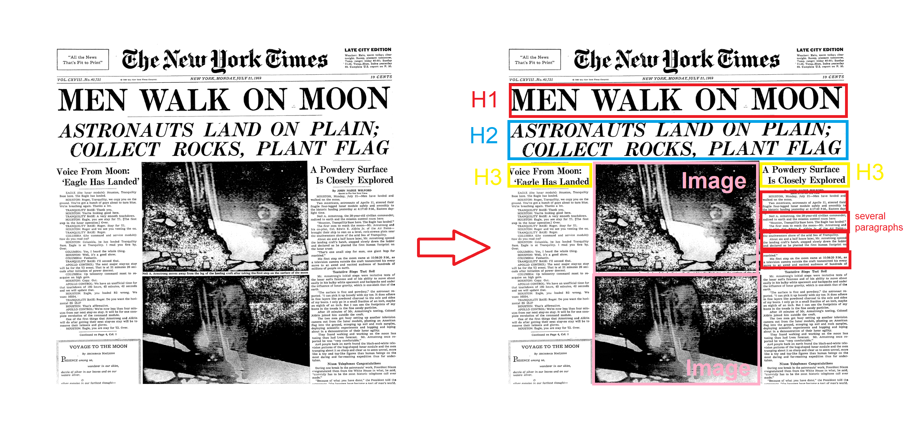

# Participation: Mark Up the Newspaper

## Goal

Get some practice with the theory behind marking a page up semantically.

I want to highlight how important it is to choose elements semantically, that is, in a way that most accurately describes the content's meaning. If we don't like how it looks, then we can change that later using style sheets.

A semantically marked-up document ensures your content is available and accessible in the widest range of browsing environments, from desktop computers and mobile devices to assistive screen readers. It also allows non-human readers, such as search engine indexing programs, to correctly parse your content and make decisions about the relative importance of elements on the page.

## Overview

This assignment shouldn't be too difficult. You'll be highlighting some images of newspaper articles and labeling the elements of the article. See my half finished example below for a rough idea:

Try to stick with HTML elements of you can, but for the practice of this exercise, it is more important to sematically mark up the newspaper article as you see fit. 

## Instructions

1. Download the [starter samples](samples.zip)
2. Open up your favorite image editor like photoshop or MS paint.
3. Semantically mark up the samples to the best of your ability.
4. Save the updated images.

## Submitting

Don't forget to submit to the my courses dropbox. See the assignment for submission guidelines.