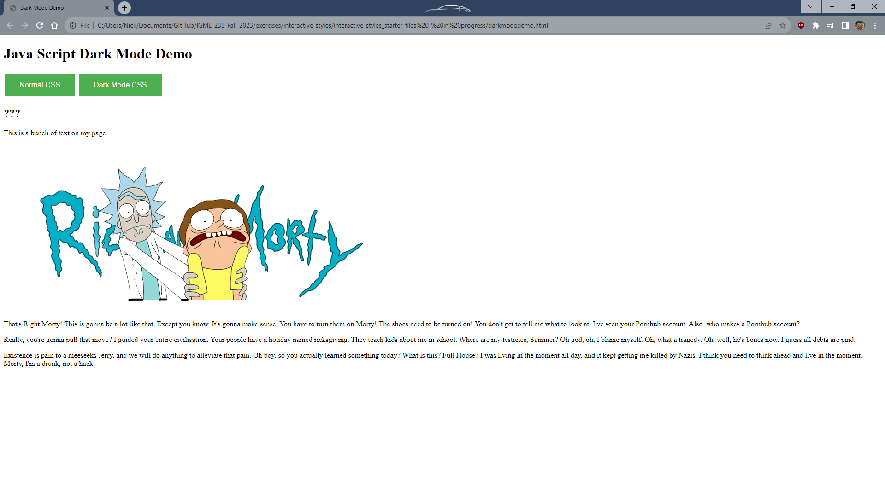
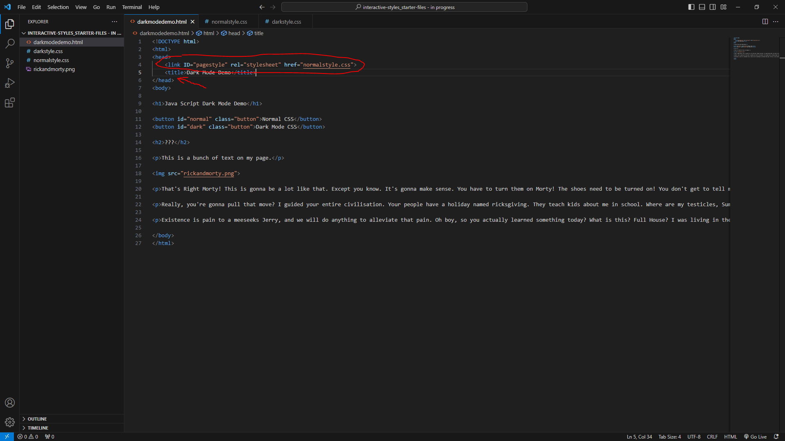
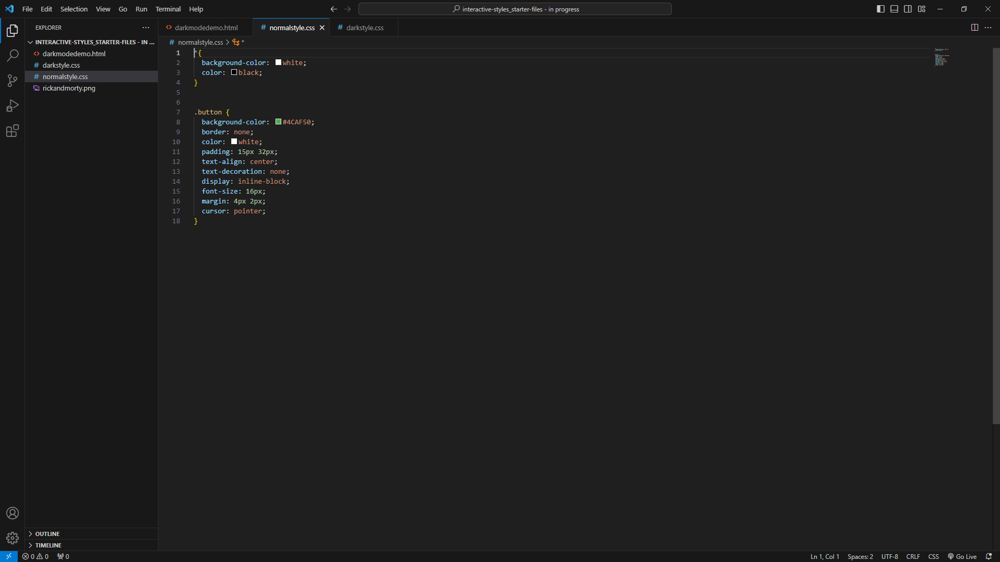
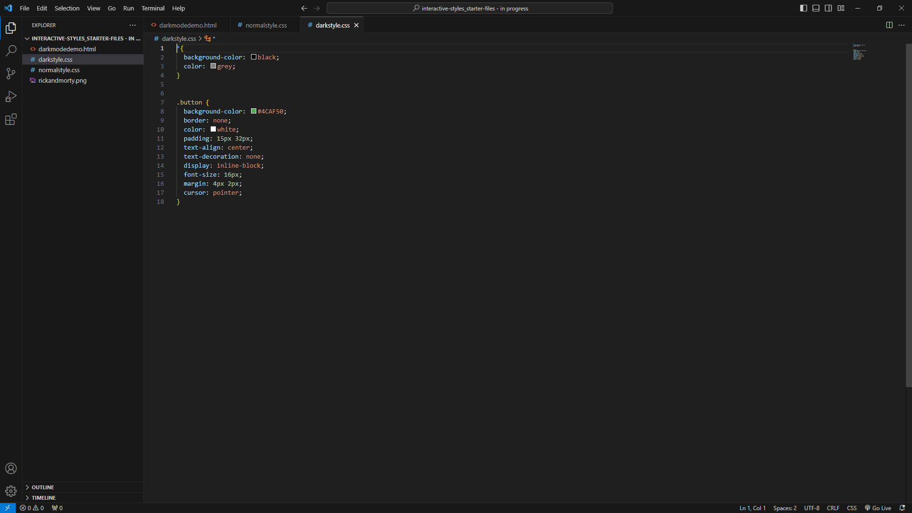
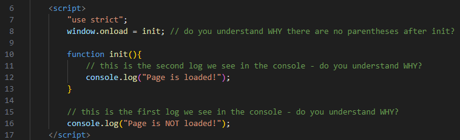
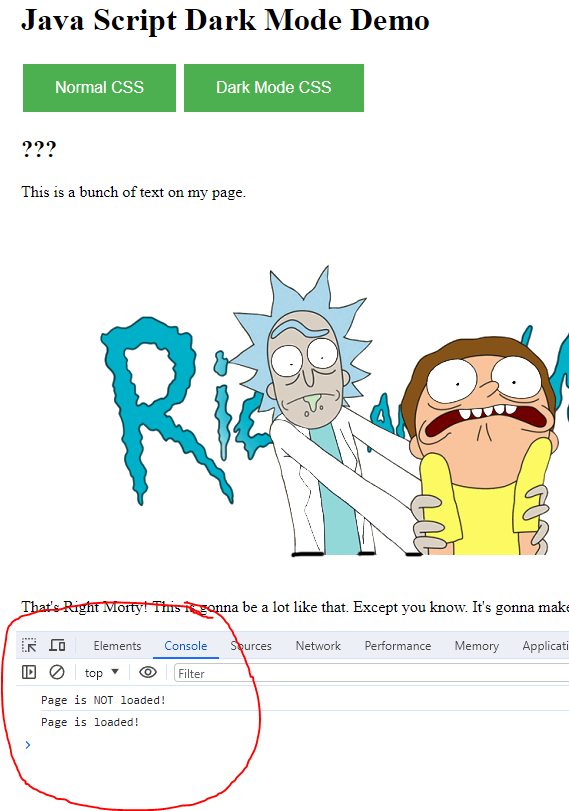
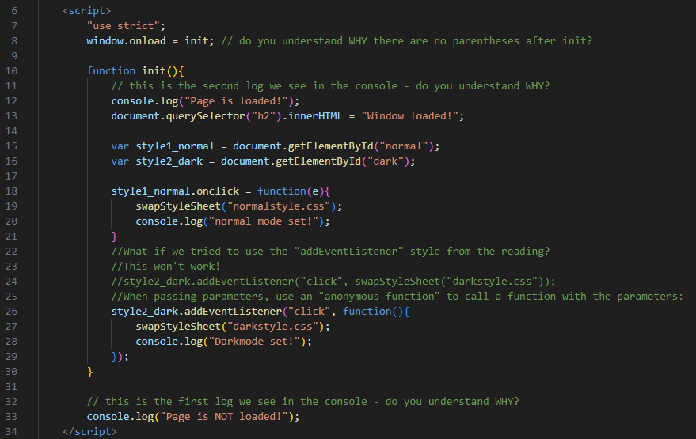
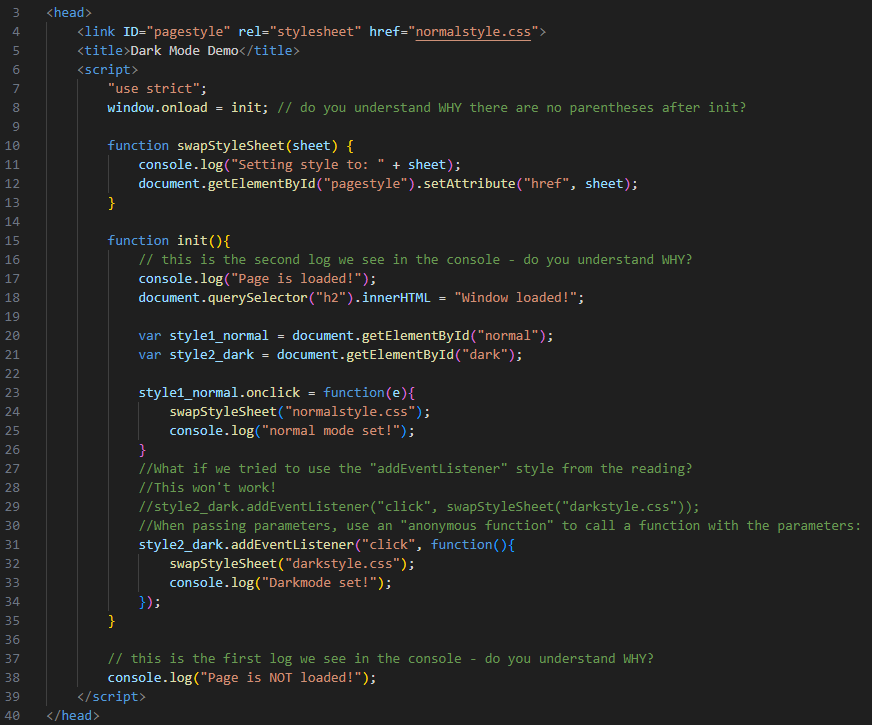
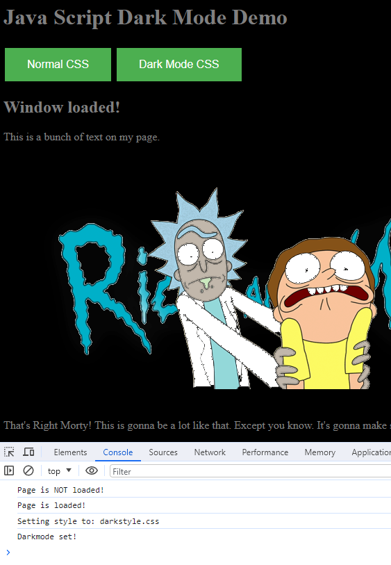
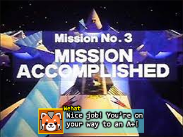

# Participation: Interactive Styles
## Set Up
We know about marking up HTML semantically and that we can apply styles to change the way that HTML looks to a user. We also know that the same underlying content can look vastly different when different styles are applied. Maybe you remember the [css zen garden](https://www.csszengarden.com/pages/alldesigns/) website example from a few weeks ago. Yes, all those pages look vastly different, but that's just the style applied. 

We also have been learning about some basic web interactivity through JavaScript. So what if we combined the knowledge from these two separate areas and made something semi-practical and useful for our users? 

What if we had a point of interactivity? What if we had a button for a user to change between style sheets?

Our goal won't be to have styles be vastly different like in the zen garden website, but something a bit simpler. Our goal will be to have a button that can switch between a normal style and a dark style.

## Goal
To use our new knowledge of JavaScript to implement a button that can change the stylesheet of our webpage between a normal stylesheet and a dark mode stylesheet.

## Preview
Here is an example of what we will have by the end of this practice exercise.


## Instructions

Let's get started by downloading and opening up the [starter files](interactive-styles_starter-files.zip).

Let's preview `darkmodedemo.html` in our web browser of choice.



Try pressing the buttons. As you can observe, there is no interactivity yet. This makes sense because that's what we will be adding!

We will only be writing code inside of `darkmodedemo.html`, but let's open up `darkmodedemo.html`, `normalstyle.css`, and `darkstyle.css` in your editor of choice and look over the files quickly.



Looking inside `darkmodedemo.html` we see that the page loads the `normalstyle.css` style sheet. We also see that we currently don't have any JavaScript written yet.



If we preview `normalstyle.css`, then we see that there isn't much going on here. This stylesheet sets the background to white and text to black.

It also has the styles for the button class.



If we preview `darkstyle.css`, then we see that it's nearly identical to `normalstyle.css`. The only difference is that this stylesheet sets the background to black and text to grey.

And yeah, minimal style changes, we could definitely do more. But I think it's better to keep things simple and focus on the core of the exercise here, which is the interactivity!

So let us go back to the `darkmodedemo.html` and add in some magical JavaScript!

Find the `<head>` block and write in a new `<script>` tag. This is where we will place all our JavaScript for this exercise.

Inside your new `<script>` block write in `"use strict";` as we have been doing in our web-apps-tutorials. 

Directly underneath on the next line write:
```
window.onload = init;
```

Right before the end of your `script` tag, throw in a console log that says "Page is NOT loaded!"

And somewhere inbetween your `window.onLoad` and your `console log` create an `init()` function that prints out to the console that the page is loaded.

I've included my code below if my explanation was a little unclear.



You might notice that I added some comments. These are for YOU! Let's refresh the page in our web browser and check out the console.



If you do not understand why the order of these prints is happening and you can't answer all the questions posed in the code comments, then go back and read web-apps-tutorials chapters 3 and 5. I'll give you a hint. It has to do with waiting until the page loads fully. Can you take an educated guess now? 

In chapter 6, we will go over it in more detail when we talk about JavaScript Events. 

In chapter 3, we briefly discussed waiting until after the page loads. Our simple answer on how to fix this was to simply run the code after the page loads. There are several ways to accomplish this. And definitely for now, the easiest way was to move the `<script>` tag to just before the closing `<body>` tag. But I personally don't like that, so I'll give you a small preview of what is to come in our future web-apps-tutorials.  

We don't need to use init() functions, but I like them because it helps keep me stay chronologically ordered and organized. 

And you also totally don't need to add this to Project 1, but I figured I'd move up this exercise a bit in case you did want to include something like this in your project 1, whether it be your portfolio or something else.

Anyway, sorry for the side tangent. Let's get back to coding!

Go back into the `init()` function and add in the following code:
```
document.querySelector("h2").innerHTML = "Window loaded!";
```

Refresh your page. Did you notice the change? Scroll up a bit to the last preview image or look at the code in your HTML markup so you can compare the before and after. What do you think would have happened if we didn't wait until the page loaded to do that?

> **Note:** *Ok, so if you are trying to get this done before or for project 1, then we are REALLY getting to the point where we haven't covered this stuff yet. So, just follow along and remember for later. That way maybe, the stuff will at least be familiar when we cover it. If you are working on this exercise AFTER project 1 has been completed, then we will have already covered this stuff and you should have no issues.*

Let's also create 2 more variables in our `init()` function, one to hold the id element corresponding to normal and the other to dark. You can find my declaration below:

```
var style1_normal = document.getElementById("normal");
var style2_dark = document.getElementById("dark");
```

Now that we have references to our buttons, let's take advantage of events. We will do the first button one way, and the second button another way, just to show the variety. 

For the first button, we will take advantage of the `onclick` event. You can see my code below:

```
style1_normal.onclick = function(e){
    swapStyleSheet("normalstyle.css");
    console.log("normal mode set!");
}
```

Here, when the button is clicked, we call our `swapStyleSheet` function, don't worry. We have yet to write it! We also print out to the console, because who doesn't love a little debugging feedback? 

Let's code up the second event function. What if we tried to use the "addEventListener" style from the reading? 

For example: `style2_dark.addEventListener("click", swapStyleSheet("darkstyle.css"));`

This won't work! When passing parameters, we need to use an "anonymous function" to call a function with parameters.

I've included the comments in my code sample, in case you forget when you copy & paste.

```
//What if we tried to use the "addEventListener" style from the reading?
//This won't work!
//style2_dark.addEventListener("click", swapStyleSheet("darkstyle.css"));
//When passing parameters, use an "anonymous function" to call a function with the parameters:
style2_dark.addEventListener("click", function(){
    swapStyleSheet("darkstyle.css");
    console.log("Darkmode set!");
});
```
In case that was a little too crazy of an adventure, this is what the code should look like at this point:



Now we need to code up that `swapStyleSheet` function we name dropped earlier.

Above `init()`, let's declare a new function called `swapStyleSheet` and have it take in a parameter, which will be the name of our stylesheet to swap to. 

Based on our knowledge of how we can select elements and set attributes, do you think you can guess how to set up this function? Go on, try it on your own before looking any further.

Here is my function if you are having trouble:
```
function swapStyleSheet(sheet) {
    console.log("Setting style to: " + sheet);
    document.getElementById("pagestyle").setAttribute("href", sheet);  
}
```

I threw in a console log to see what style sheet I was about to swap to for debugging sanity.

At this point, my code looks like this for your personal reference:



This would be a great time to save, refresh the page, and see if our hard work has yielded bountiful results!



Click on the "dark mode" button! Did it swap? Do you see similar results to mine in the console?

> **Note:** *So, as we learn more and more, you might notice more potentially cool interactions between all the "tools in your toolbox", some we might practice directly, like in this example here, but it will REALLY be up to you to notice potential opportunities and creatively apply your knowledge of theory and combine your skills to solve problems out in industry. I wish you the best and as always, good luck and have fun!*

## Conclusion

At this point, we are complete in our objective to use JavaScript to create an interactive button to swap our page's style.

Congratulations! 



## Submitting

Don't forget to submit to the mycourses dropbox. See the assignment for submission guidelines.

## Bonus Levels: Where can we go from here? 

For the programmers:
- Do you think you can code this same feature up, but with only one button?

For the designers:
- Rick and Morty is cool, but can you swap out the content? Can you make the normal content be about Superman and the dark mode content be about Batman?

These challenge mode tasks won't give you more points toward your grade, but you can brag about it in Slack if you figure it out and want to show off to your peers!