# Participation: RWD - Media Query Magic
## Goal
To get some hands-on experience writing your first media query, see the power of media queries in action, and check out the `toggle device toolbar` feature of the chrome developer tools. 
## Preview
Here is an example of what we will have by the end of this practice exercise.

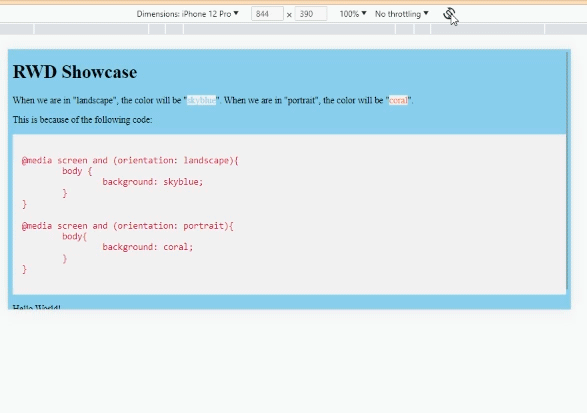

If you don't understand what is going on here, then let me explain fast. 

Basically:
- I have the chrome developer tools on
- Set the device to simulate an iPhone
- I'm switching from portrait to landscape mode
- Because of the media queries we will write in this exercise, the background color changes depending on the orientation. 

## Instructions
Now we get to the real meat of *responsive web design* — media queries! **Media queries** apply different styles based on characteristics of the browser: its width, whether it is vertically or horizontally oriented, its resolution, and more. They are what make it possible to send a one-column layout to small screens and a multicolumn layout to larger screens on the fly.

Let's get started by downloading and opening up the [starter files](rwd-media-query-magic_starter-files.zip).

We won't be touching any HTML today. Everything we do will be in `styles.css`.

If you were to open the webpage in your favorite browser, then you would see this:

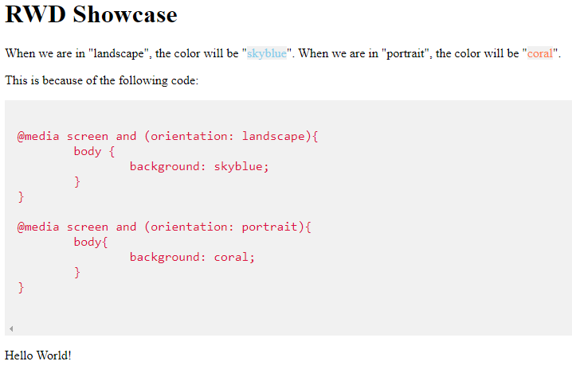

The query itself includes a media type followed by a particular feature and a value for which to test. The criteria are followed by a set of curly brackets that contain styles to apply if the test is passed. The structure of a media query as used within a style sheet goes like this:

```css
@media type and (feature: value) {
  /* styles for browsers that meet this criteria */
}
```

Alright, let's actually use this template and plug in some real values.

The following media queries look at whether the viewport is on a screen and in landscape (horizontal) or portrait (vertical) orientation. When the query detects that the viewport is in landscape mode, the background color of the page is “skyblue”; when it is in portrait orientation, the background is “coral”.

```css
@media screen and (orientation: landscape) {
  body {
     background: skyblue;
     }
}
@media screen and (orientation: portrait) {
  body {
    background: coral;
    }
}  
```

If this were displayed on a smartphone that tips from vertical to horizontal and back again, the colors would change as it tilts. 

Let's go ahead and add this code into our `styles.css` file. Line 2 is probably a good place to plop it.

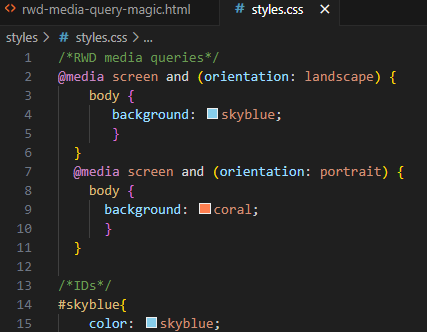

If we were to refresh our web browser, we would now see this:

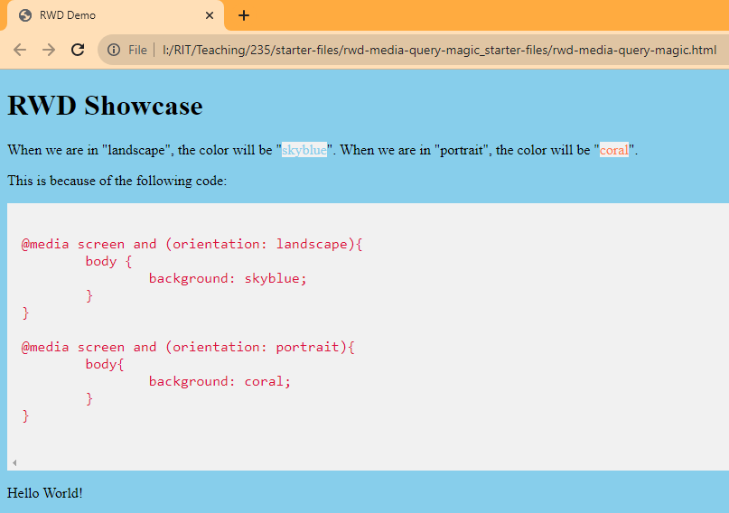

Awesome! The browser detects that the screen is in an orientation of landscape and applies the appropriate style based on the media query.

But how can we test the media query in action?

Well, we could upload this file to banjo and test it on our mobile device. This is a great idea. We always want to test our website on multiple devices. But we don't always have access to multiple devices. I think this is a great time to showcase another nice feature of the chrome developer tools. 

Let's open up the chrome developer tools. You remember how to do that right? 

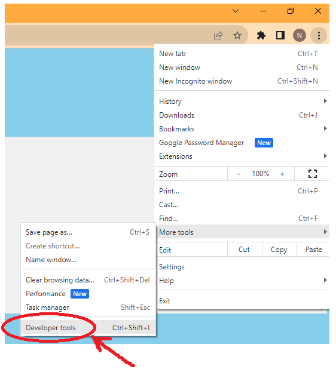

The chrome developer tools are essential for our work. They help us in the debugging process. We should never forget about them.

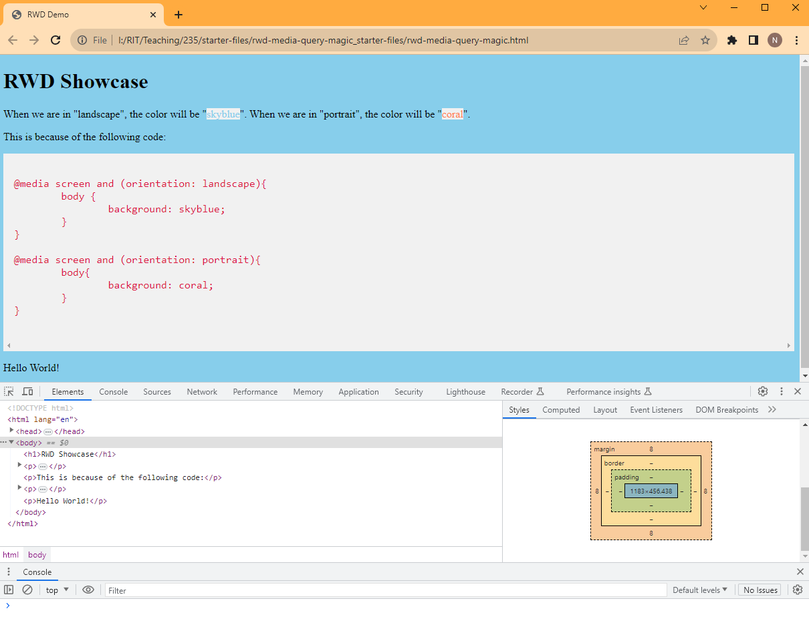

Let's check out another feature of the developer tools, the `toggle device toolbar`. This will give us the ability to preview our website on a variety of devices. Some of which we may not normally have access to in real life. So, that's pretty awesome!

To open up the tool, click on the icon that looks like a mobile device in front of a laptop.

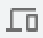

You can find it here:

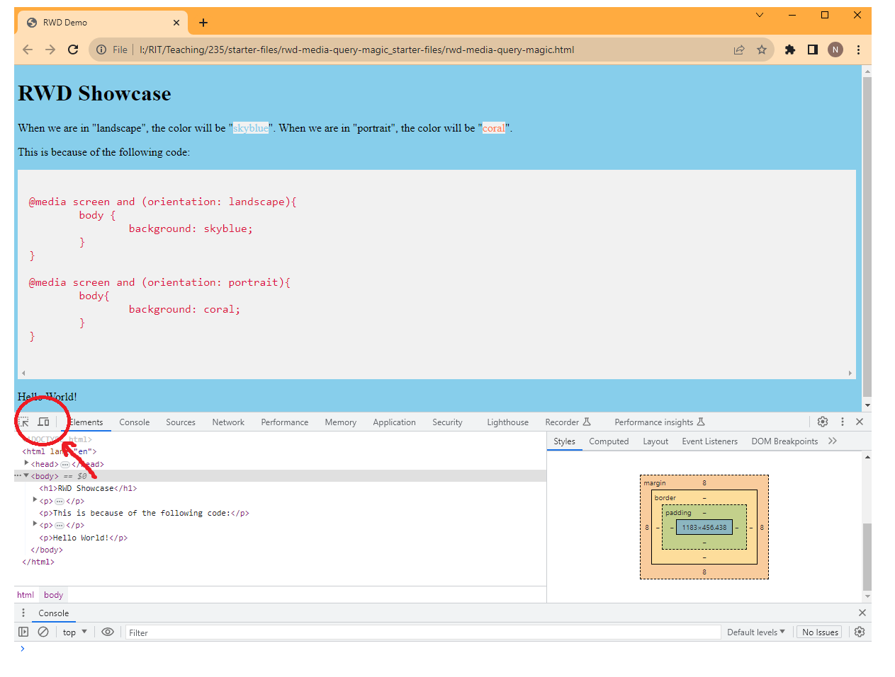

Once you do that, you might notice some changes in the browser. 


Let's check out the toolbar at the top of the page.

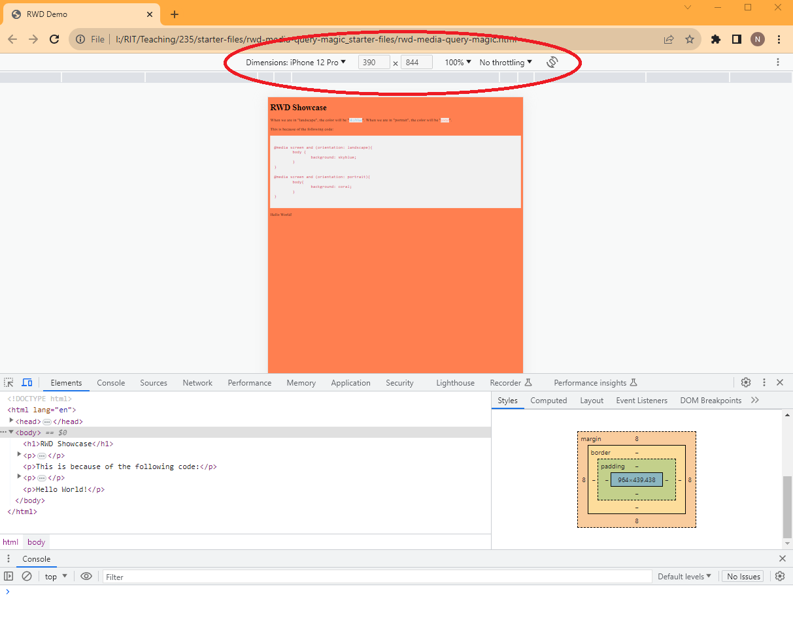

Here you can change and mess with a few things.

- Dimensions (screen size)
- Zoom Level (100% is "Actual Size" for device. If you held up your phone to the screen. It would be that same size.)
- Throttling (Kinda like device specs, useful if you are testing like javascript or how your game is running on a "low-end" device.)
- Orientation (how we will test our media query today)

I'll talk about the dimensions drop down for a minute. The "responsive" option is probably the most versatile. Here you can manually update the dimensions numbers. 

But it also has a really nice quick response feature to navigate through common display sizes such as mobile S, mobile Large, Tablet, Laptop, and I believe it goes all the way up to 4K monitor. In case you want to see what your content looks like scaled up on those ultra wide monitors instead of scaled down on a mobile device. 

To access the quick generic presets, hover your cursor over the various grey boxes right under the toolbar.

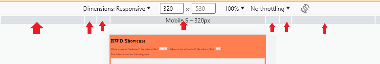

All the other options in the dimensions drop down are convenient presets, such as iPhone SE, iPad Air, etc etc. This is nice if you want to see what it would look like on specific devices. 

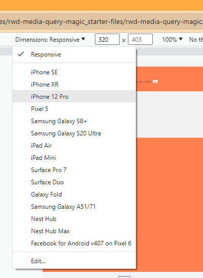

I doubt you'll use this, but at the very bottom is edit.

Here you can add/remove the presets from the list. This is useful for other older/newer mobile devices that aren't in the list by default, like the iPad Pro.

You can also add in your own custom devices with custom dimensions. You know so we can test on the REALLY cool devices, like the web browser on my Nintendo 3DS or the screen on my refrigerator. 

Which is good to know... because I'll be grading your final project from my PSP! :scream:

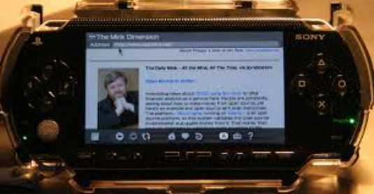

Just kidding. Just kidding. :innocent:

Alright. Let's get back to the media query magic. 

Why don't we select "Mobile S - 320px" via the grey box preset or the "iPhone SE" from the quick dropdown menu.

Let's then use the rotate option, to switch from "landscape" to "portrait" on our mobile device and vice versa. 


This isn’t a very practical design choice, but it does provide a very simple illustration of media queries at work. 

A much more practical application would be to utilize widths and breakpoints to have more responsive layouts, as you'll mess around with in a future homework: holy grail. Or maybe even utilize `@media print` and have a separate style sheet for when a user hits `Ctrl-P` and wants to print out your website nicely or save it as a `.pdf`.

## Conculsion

Well, that's it, friends. Hopefully, you enjoyed it, saw the power of media queries in action, and were successfully introduced to another aspect of the chrome developer tools. 

Congrats! You gained some XP. Now celebrate by dancing!


## Submitting

Don't forget to submit to the mycourses dropbox. See the assignment for submission guidelines.