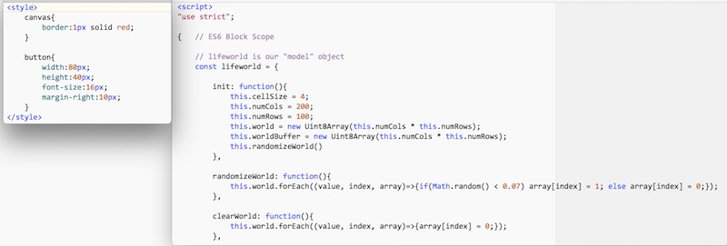
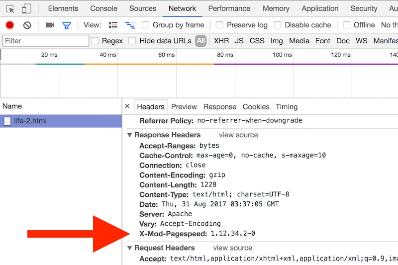

# Saving banjo.rit.edu from itself

## 0. Big News!

Lucky you!  It turns out that the majority of this exercise is no longer necessary because recently (just this past Summer of 2023), ITS (the department in charge of RIT's "personal website webserver") upgraded banjo.rit.edu and disabled the problematic Module described below.  It might be an interesting read to see what was wrong with it and what we used to have to do to work around it, but everything in Part I through Part IV is no longer necessary.  That said, Parts V and VI are still important to read through, so feel free to skim ahead if you wish.

## I. Overview

`banjo.rit.edu` is the new RIT web server for http://people.rit.edu

While this new web server solved a lot of problems we had with the old `gibson.rit.edu`, it also created a host of new ones. 
Most of these new issues are because Banjo had enabled the [Google PageSpeed Module](https://www.modpagespeed.com) to help pages load significantly faster and more consistently. 

+ https://moz.com/blog/use-googles-pagespeed-module-to-dramatically-increase-the-speed-of-your-website

Unfortunately, there were undesirable byproducts for creators of web pages that were under active development: it made HTML/CSS/JavaScript debugging more difficult, and HTML validation impossible. So, we basically needed to "turn it off" for all of our 235 web development.

### An example of PageSpeed module causing trouble!
**A) Here's some CSS and JavaScript we'd created for a simple game. Note how the &lt;style&gt; and &lt;script&gt; tags are nicely indented and easy to read.**




**B) When we uploaded it to Banjo, and viewed it in the Inspector, you can see how the white space had been stripped out of the contents of the &lt;style&gt; and &lt;script&gt; tags, and the code is harder to read and debug.**


**C) If we look in the Inspector again, under the Network tab, we could actually see that the Banjo server was utilizing an HTTP header (`X-Mod-Pagespeed`) to let the web browser know "Hey, I'm using the PageSpeed module!"**




***In this instance, the browser doesn't seem to be doing anything about it that we know of. But because HTTP headers are human readable, it was easy for us as web developers to see why our CSS and JS was getting compressed. Move on to the next part to see how we turned off the PageSpeed module!***

## II. .htaccess files to the rescue!

.htaccess files allow you to make web server configuration changes on a per-folder basis. 

Previously, we'd have given you a text file named "htaccess" that contained a single line of text:

`ModPagespeed off`

This unsurprisingly told the web server to disable the PageSpeed module for the directory that contains the file, and all of its sub-directories.

Note: htaccess files are *plain text* files - just like HTML, CSS or JS files - make sure they DO NOT have any kind of file extension when you create them (example `.txt`, `.html` etc).

***Further historical note***:  This technique actually caused a problem when they upgraded banjo.rit.edu and removed the ModPagespeed Module because then the previous line of code actually caused an error!  In retrospect we should have wrapped our command like this:

```
<IfModule pagespeed_module>
  ModPagespeed off
</IfModule>
```

Alas, we didn't do it that way, so hundreds of students websites suddenly stopped working!  We quickly contacted ITS and worked out that they'd re-enable ModPagespeed, but leave it turned off by default.  Phew! Live and learn.

## III. Instructions that you no longer need to follow:
1. Using your SFTP client of choice, upload this file to the `www` folder on your banjo.rit.edu account.
2. Then, on Banjo, change its filename from htaccess to .htaccess (just add a "." to the front of the name). Make sure you set the permissions on this file to 644. Then you should be all good!
3. **Important:** If you already have a .htaccess file in the www folder, don't replace it with the one we gave you. Instead, just add `ModPagespeed off` to the end of it.

**Note:** The reason we don't use the "." before uploading the file is that on Unix-based systems, like the Mac, any file starting with a "." is considered a system file and *hidden* - i.e., invisible, and difficult for us to find in order to upload to the server.

## IV. Discussion:
*If you did everything correctly, you'd have disabled the PageSpeed module for your www folder and all of its sub-directories.*

*If you checked the Inspector's Network tab again you should have seen that Banjo was no longer sending the `X-Mod-Pagespeed` header, which meant that Banjo was no longer compressing the CSS & JS before sending the page to the web browser.*

*So what do .htaccess files DO? They simply let us "script" the behavior of the web server on a per-folder basis.*


## V. One more thing: HTTPS versus HTTP (This is still important!)
One more thing to watch for on banjo - external scripts must be downloaded *securely* via **https** rather than by *insecure* **http**.

Example - this will fail on banjo:

`<script src="http://code.jquery.com/jquery-2.2.0.min.js"></script>`

Your code will fail and you will see this error in the browser console:

`The page was not allowed to run insecure content from http://code.jquery.com/
jquery-2.2.0.min.js.`

If you change the 'src' value to the following (utilizing `https` instead of `http`), the jQuery will now successfully load:

`<script src="https://code.jquery.com/jquery-2.2.0.min.js"></script>`

## VI. One last thing: Using PuTTY or Terminal to ssh to 'banjo.rit.edu`

If you remember your basic Unix commands from IGME-110, then creating and maintaining .htaccess files directly on the server is **a lot easier** than editing text files locally and using FTP to transfer them to banjo.  You could have done the following:

1. Fire up your preferred console app

2. Connect to banjo
```
ssh abc1234@banjo.rit.edu
```

3. "Change directory" to your `www` folder
```
cd www
```

4. Open up (or create) your .htaccess file in the nano text editor (or another editor if your prefer):
```
nano .htaccess
```

5. Make your changes, and then save the file (control-o) and exit (control-x)

```
ModPagespeed off
```
