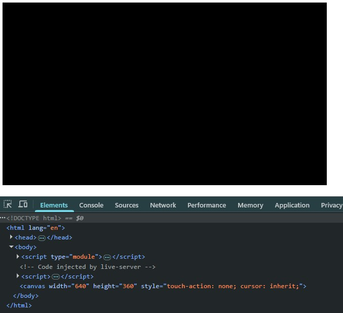
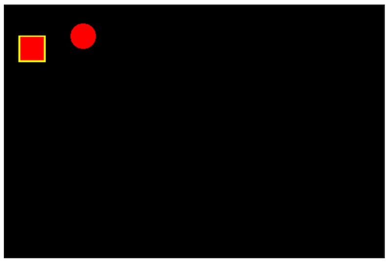
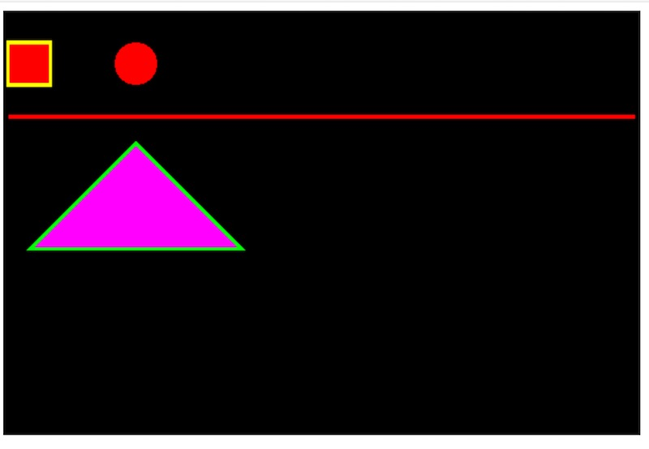
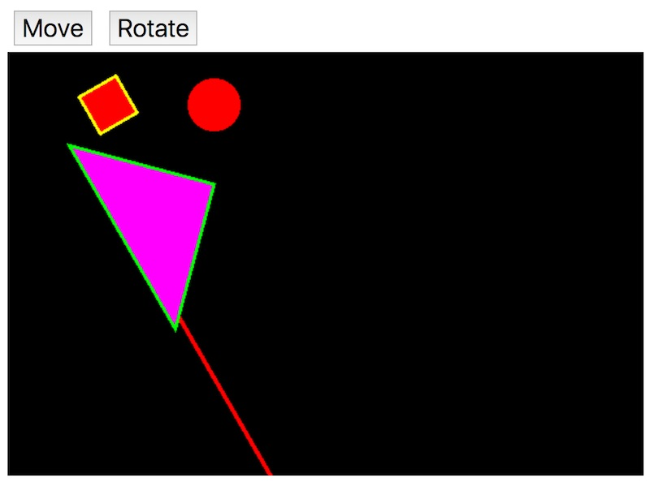
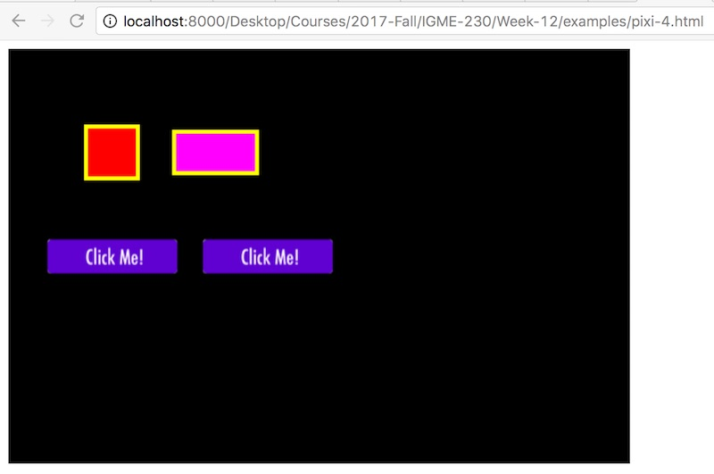

# 1 - Intro to PixiJS

## Overview
About PixiJS:
- 2D Rendering Engine - put stuff on the screen - designed for speed and performance
- Primarily you get sprites and a scene graph, but not a full game engine. Game engines have physics, sound, etc 
- Uses the browser's [WebGL](https://developer.mozilla.org/en-US/docs/Web/API/WebGL_API) for drawing - which is fast because WebGL runs on the GPU!
- Basically is a "wrapper" for WebGL.
- Seamlessly falls back to [&lt;canvas>](https://developer.mozilla.org/en-US/docs/Web/API/Canvas_API) on older browsers
- Easy to use
- Free and Open Source
- Originally created as a [Flash](https://en.wikipedia.org/wiki/Adobe_Flash) replacement, much of the API is similar
- Here is what the [creator of PixiJS says about it](https://www.youtube.com/watch?v=OWsz19OFUpc&t=32)

## Contents
<!--- Local Navigation --->
I. [PixiJS Resources](#section1)

II. ["Hello PixiJS"](#section2)

III. [Drawing Shapes](#section3)

IV. [Two More Shapes](#section4)

V. [Adding DOM Button Events](#section5)

VI. [Sprites and Displaying Images & Running code on a server](#section6)

VII. [Using the Demos](#section7)

VIII. [Nota Bene](#section8)

IX. [Review Questions](#section9)

X. [Review Exercise](#section10)

<hr>

<hr>

## I. <a id="section1">PixiJS Resources
PixiJS has fantastic example code and an active community of developers. Here are some helpful links:

- http://www.pixijs.com
- http://www.pixijs.com/gallery
- https://pixijs.download/release/docs/index.html
- https://pixijs.com/8.x/examples
- https://pixijs.com/8.x/guides
- http://www.pixijs.com/tutorials


and 

- https://github.com/kittykatattack/learningPixi

PixiJS pretty much just gives you *sprites*, but there are many plugins available that give additional functionality: 

- https://github.com/pixijs
- https://github.com/kittykatattack/bump (Old)
- https://github.com/kittykatattack/smoothie (Old)
- https://github.com/Nazariglez/pixi-keyboard
- https://github.com/pixijs/pixi-sound
- https://github.com/pixijs/pixi-particles


## II. <a id="section2">"Hello PixiJS"

Here is your first PixiJS program. Note that we are importing the PixiJS library from a CDN ("Content Distribution Network") rather than downloading the library ourselves.

### pixi-intro-1.html

```html
<!DOCTYPE html>
<html lang="en">
  <head>
    <meta charset="utf-8" />
    <title>PixiJS-1</title>
    <script src="https://pixijs.download/release/pixi.min.js"></script>
  </head>
  <body>
    <script type="module">
      // #1 - Create a new Pixi application
      // https://pixijs.download/release/docs/app.Application.html
      const app = new PIXI.Application();
      await app.init({ width: 640, height: 360 });

      // #2 - Append its "view" (a <canvas> tag that it created for us) to the DOM
      document.body.appendChild(app.canvas);
    </script>
  </body>
</html>

```

### Which looks like this:


### Notes
- You should see the 600x400 black canvas that PixiJS created for us in the browser
- You should also see this canvas in the Web Inspector
- *Can you re-position the &lt;canvas> tag?* Sure, just use CSS style rules.
- *Can you change the background color to something other than black?* Sure! With this line of code:

`app.renderer.background.color = 0xff00ff; // Magenta!`

**or**

Set it when you initiate the app with the `init` method like so:
`await app.init({ background: "#ff00ff", width: 640, height: 360 });`


## III. <a id="section3">Drawing Shapes
We can use PixiJS to create geometric shapes using PIXI.Graphics - https://pixijs.download/release/docs/scene.Graphics.html

### pixi-intro-2.html


```html
<!DOCTYPE html>
<html lang="en">
  <head>
    <meta charset="utf-8" />
    <title>PixiJS-2</title>
    <script src="https://pixijs.download/release/pixi.min.js"></script>
  </head>
  <body>
    <script type="module">
      const app = new PIXI.Application();
      await app.init({ width: 640, height: 360 });
      document.body.appendChild(app.canvas);

      // #1 - Create a square
      // https://pixijs.download/release/docs/scene.Graphics.html
      const square = new PIXI.Graphics();
      square.rect(0, 0, 40, 40); // x, y, width, height
      square.fill(0xff0000); // red in hex
      square.x = 25;
      square.y = 50;
      square.stroke({ width: 2, color: 0xffff00, alpha: 1 }); // yellow border

      app.stage.addChild(square); // Add the square to the stage

      // #2 - Create a circle
      const circle = new PIXI.Graphics();
      circle.circle(0, 0, 20);
      circle.fill(0xff0000);
      circle.x = 125;
      circle.y = 50;

      app.stage.addChild(circle);
    </script>
  </body>
</html>
```

### Which looks like this:


### Notes:
- Here we used the Graphics() object to create 2 shapes. We gave the square above both a stroke (on border of shape) and a fill (the inside of the shape).
- Graphics docs are here: https://pixijs.download/release/docs/scene.Graphics.html
- Note that colors are in JavaScript's hexadecimal number format and always begin in `0x`. Fun fact - in JavaScript you can also create octal numbers - they begin with a zero - here's an example: `parseInt(0111) // 73`
- Why are the circle and square not at the same "y" on the screen? Because the circles are drawn from the center by default, and the squares are draw from their upper-left corner by default. We can change the square's drawing behavior to match the circle's by changing this line  of code:

	`square.rect(0, 0, 40, 40);`

	to this: 

	`square.rect(-20, -20, 40, 40);`

## IV. <a id="section4">Two More Shapes

### Add the following to pixi-intro-2.html

```javascript
// #3 - Create a line
const line = new PIXI.Graphics();
line.moveTo(0, 0);
line.lineTo(590, 0);
line.stroke({ width: 4, color: 0xff0000 });
line.x = 5;
line.y = 100;

app.stage.addChild(line);

// #4 - Create a polygon
const poly = new PIXI.Graphics();
poly.moveTo(0, 0);
poly.lineTo(-100, 100);
poly.lineTo(100, 100);
poly.lineTo(0, 0);
poly.fill(0xff00ff);
poly.stroke({ width: 3, color: 0x00ff00, alpha: 1 });
poly.x = 125;
poly.y = 125;
app.stage.addChild(poly);
```

### Which gives us:




## V. <a id="section5">Adding DOM Button Events
We can add DOM buttons to our web page, add event handlers to them, and then call properties and methods on our PixiJS objects.

### pixi-intro-3.html

```html
<!DOCTYPE html>
<html lang="en">
  <head>
    <meta charset="utf-8" />
    <title>PixiJS-3</title>
    <style>
      button {
        font-size: 1.5em;
        margin: 0.25em;
      }
    </style>
    <script src="https://pixijs.download/release/pixi.min.js"></script>
  </head>
  <body>
    <div>
      <button id="move">Move</button>
      <button id="rotate">Rotate</button>
    </div>
    <script type="module">
      const app = new PIXI.Application();
      await app.init({ width: 640, height: 360 });
      document.body.appendChild(app.canvas);

      // #1 - Create a square
      // https://pixijs.download/release/docs/scene.Graphics.html
      const square = new PIXI.Graphics();
      square.rect(-20, -20, 40, 40); // x, y, width, height
      square.fill(0xff0000); // red in hex
      square.x = 25;
      square.y = 50;
      square.stroke({ width: 2, color: 0xffff00, alpha: 1 }); // yellow border

      app.stage.addChild(square); // Add the square to the stage

      // #2 - Create a circle
      const circle = new PIXI.Graphics();
      circle.circle(0, 0, 20);
      circle.fill(0xff0000);
      circle.x = 125;
      circle.y = 50;

      app.stage.addChild(circle);

      // #3 - Create a line
      const line = new PIXI.Graphics();
      line.moveTo(0, 0);
      line.lineTo(590, 0);
      line.stroke({ width: 4, color: 0xff0000 });
      line.x = 5;
      line.y = 100;

      app.stage.addChild(line);

      // #4 - Create a polygon
      const poly = new PIXI.Graphics();
      poly.moveTo(0, 0);
      poly.lineTo(-100, 100);
      poly.lineTo(100, 100);
      poly.lineTo(0, 0);
      poly.fill(0xff00ff);
      poly.stroke({ width: 3, color: 0x00ff00, alpha: 1 });
      poly.x = 125;
      poly.y = 125;
      app.stage.addChild(poly);

      // #5 Target shape x positions by adding events to move button
      document.querySelector("#move").onclick = (e) => {
        square.x += 10;
        circle.x += 10;
        line.x += 10;
        poly.x += 10;
      };

      // #6 Target shape rotations by adding events to rotate button
      document.querySelector("#rotate").onclick = (e) => {
        let amt = Math.PI / 6;
        square.rotation += amt;
        line.rotation += amt;
        poly.rotation += amt;
        circle.width += 5;
        circle.height += 5;
      };
    </script>
  </body>
</html>
```

### Which gives us (after we click the buttons a couple of times):



## VI. <a id="section6">Sprites and Displaying Images & Running code on a server

The Sprite class allows us to display textured images in the jpeg, png, or gif format: https://pixijs.download/release/docs/scene.Sprite.html

Here is the button image we will use below (right-click to save) --> 

<hr>

### IMPORTANT!

One restriction you are going to run into is when your script tries to load an image off of your computer's hard drive - the CORS (Cross-Origin Resource Sharing) restriction kicks in and the image will be blocked from loading. For example, the error message in Chrome for the code below is:

```
Access to Image at 'file://button-130.png' from origin 'null' has been blocked by CORS policy: Invalid response.
Origin 'null' is therefore not allowed access.
```
<hr>

### Solutions? 

- Run the code off of a web server, which you can do by uploading your code to Banjo.
- Use an IDE like [Brackets](http://brackets.io) - which creates a local web server for you to run your code on.
- [You can also create a web server using Python](https://developer.mozilla.org/en-US/docs/Learn/Common_questions/set_up_a_local_testing_server) on your local machine.
- [Firefox Developer Edition](https://www.mozilla.org/en-US/firefox/developer/) turns off CORS by default, so you don't need a web server.


### pixi-intro-4.html

```html
<!DOCTYPE html>
<html lang="en">
  <head>
    <meta charset="utf-8" />
    <title>PixiJS-4</title>
    <script src="https://pixijs.download/release/pixi.min.js"></script>
  </head>
  <body>
    <script type="module">
      const app = new PIXI.Application();
      await app.init({ width: 640, height: 360 });
      document.body.appendChild(app.canvas);

      // #1 - make some squares
      const s1 = makeRectangle();
      s1.x = 100;
      s1.y = 100;

      const s2 = makeRectangle(80, 40, 0xff00ff);
      s2.x = 200;
      s2.y = 100;

      app.stage.addChild(s1);
      app.stage.addChild(s2);

      // #2 - make some PixiJS buttons
      // https://pixijs.download/release/docs/scene.Sprite.html
      const texture = await PIXI.Assets.load("images/button-130.png");
      const b1 = new PIXI.Sprite(texture);
      b1.buttonMode = true;
      b1.anchor.set(0.5);
      b1.x = 100;
      b1.y = 200;
      app.stage.addChild(b1);

      const b2 = new PIXI.Sprite(texture);
      b2.buttonMode = true;
      b2.anchor.set(0.5);
      b2.x = 250;
      b2.y = 200;
      app.stage.addChild(b2);

      // #3 add events to the buttons
      b1.interactive = true;
      // element.on('event-name',function-to-call);
      b1.on("pointerup", (e) => {
        s1.rotation += Math.PI / 12;
        s2.rotation -= Math.PI / 12;
      });

      b2.interactive = true;
      b2.on("pointerup", (e) => {
        s1.height += 20;
        s1.width += 20;
        s2.height += 20;
        s2.width += 10;
      });

      // #4 make b1 act more like a button (mouseover,mousedown etc)
      b1.on("pointerover", (e) => {
        e.target.tint = 0xbbbbbb;
      });
      b1.on("pointerdown", (e) => {
        e.target.tint = 0x888888;
      });
      b1.on("pointerup", (e) => {
        e.target.tint = 0xbbbbbb;
      });
      b1.on("pointerout", (e) => {
        e.currentTarget.tint = 0xffffff;
      });
      b1.on("pointerupoutside", (e) => {
        e.target.tint = 0xffffff;
      });

      function makeRectangle(width = 50, height = 50, color = 0xff0000) {
        // https://pixijs.download/release/docs/PIXI.Graphics.html
        let rect = new PIXI.Graphics();
        rect.rect(-width * 0.5, -height * 0.5, width, height);
        rect.fill(color);
        rect.stroke({ width: 4, color: 0xffff00, alpha: 1 });
        return rect;
      }
    </script>
  </body>
</html>
```

### Which looks like this in the browser - be sure to click the buttons to see what they do - and look over the code to understand how it's done:



### Notes:

- Sprite docs are here: https://pixijs.download/release/docs/scene.Sprite.html
- here we are using PixiJS sprites as buttons, rather than using DOM buttons like we did last time. 
- note than the PixiJS `on` method is similar to `addEventListener()` in the DOM.
- the `pointerover` and similar events will work with both mouse events and touch events.
- note our handy helper function `makeRectangle()`

## VII. <a id="section7">Using the Demos
Head to this demo page - https://pixijs.com/8.x/examples - which was linked above.

These demos are really helpful in that they nicely illustrate many of the features of PixiJS, and that you can also edit the code in place and see "live" changes.

You should also be able to copy/paste much of the code into our **pixi-1.html** template and try it out.

## VIII. <a id="section8">Nota Bene
Nothing for now.

## IX. <a id="section9">Review Questions
1. What does **CDN** stand for? What are the advantages of using a CDN?
1. What does **CORS** stand for? How can you get around it?
1. Give 2 ways to set up a local web server on your personal computer.
1. What are the hexadecimal color values for white, black, and green?


## X. <a id="section10">In-Class Exercise.  You do not need to submit this.
Make a copy of the  **pixi-intro-4.html** page and name it **pixi-js-1-HW.html** and:
1. add a PixiJS Rounded Rectangle to the screen (try to figure out, but it's optional)
1. modify the button code so that the existing buttons also target and effect the rounded rect.
1. add another PixiJS "sprite button" that reduces the size of all 3 shapes everytime it is clicked.


<hr><hr>

**[Table of Contents <- About this PixiJS Tutorial Series](pixi-js-0.md)**

**[Next Chapter -> ES6 Classes & PixiJS Animation (chapter 2)](pixi-js-2.md)**
